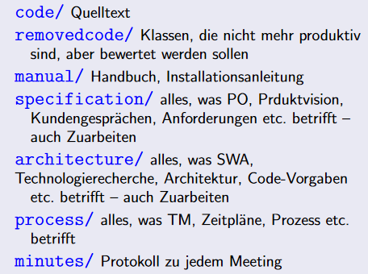

# Grapholution

Für Lehrende und Studierende die, 

die Funktionsweise von Evolutionären Algorithmen veranschaulichen und verstehen wollen, ist Grapholution ein Lehrtool,

das mithilfe einer intuitiven Benutzeroberfläche evolutionäre Algorithmen konfigurieren, erstellen und (schrittweise/in Echtzeit) visualisieren kann, 
ein breites Spektrum an Visualisierungsmöglichkeiten bietet, 
zur Laufzeit inspizierbar und veränderbar ist und
selbsterstellte Templates und Presets bietet.

Im Gegensatz zu ähnlichen Produkten bietet Grapholution eine moderne und intuitive Benutzeroberfläche und gut verständliche Visualisierungen.

## Projektstruktur

