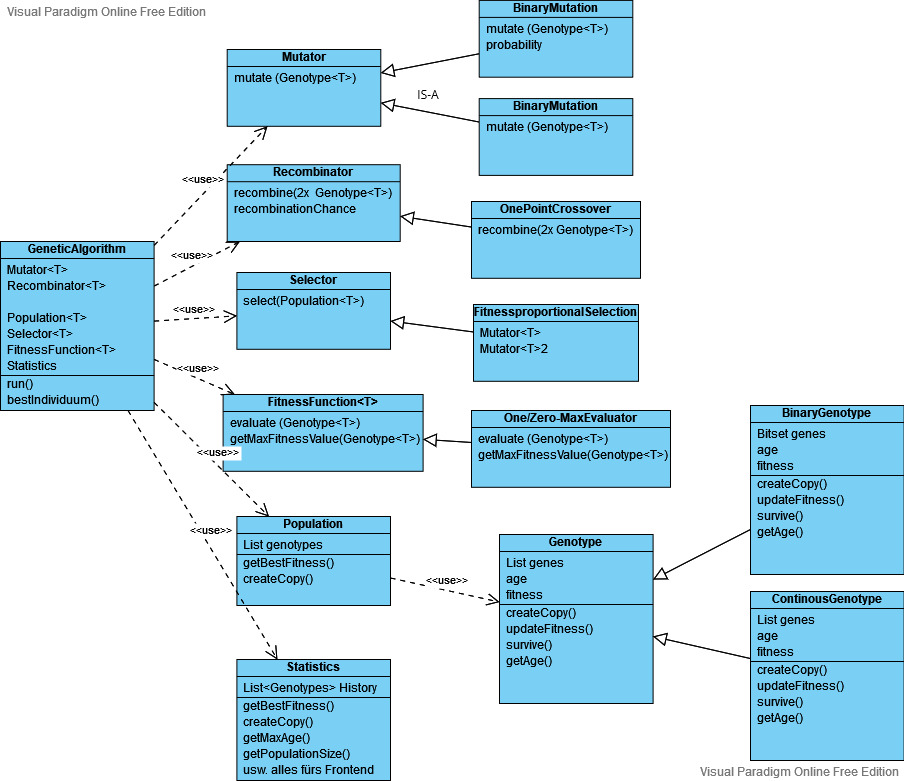

# Architektur Workshop

## Einzelne Punkte

### 1. Relationen in OOP ⇒ Composition (HAS-A) vs. Inheritance (IS-A)

- [Visualisierung des Prinzips](./cvsi.png)
- **Abhängigkeit von Genotype und Population zu List**
    - Abhängigkeit = IS-A Relation ⇒ Genotype ist aber in HAS-A Relation zu List
        - Bsp. Genotype.addAll(Genotype) ⇒ Ein Genotyp hat eine feste Länge und kann nicht an einen anderen Genotyp angehängt werden
- **Fitnessfunktion als Teil des genetischen Algorithmus**
    - GeneticAlgorithm HAS-A FitnessFunction
    - Genotype hält Daten und wird angepasst, Bewertung der Daten wird aber von außen gemacht
    - Fitness wird oft unnötig ausgerechnet und abgespeichert. Besser: Fitness erst on-demand berechnen und einmal speichern

### 2. Zuständigkeit und Kapselung
- Ein Objekt muss die Daten (Attribute) und den Code (Methoden) enthalten, die notwendig sind, um die Aufgaben durchzuführen, für die das Objekt geschaffen ist
- **Attribute zu der spezifischsten Klasse**
    - recombinationChance wird nur für recombination benötigt
    - MAX_FITNESS  hängt von Evaluator/Fitnessfunktion ab nicht von Genotype

### 3. Unterteilung der Genotypen
- BinaryGenotype extends Genotype
- ContinuousGenotype extends Genotype
- Genotype ⇒ AbstractClass oder Interface

### 4. Zusammenspiel (Interface) zwischen Backend und Frontend
- Statistik Klasse ⇒ Separation of Concerns.** GeneticAlgorithm = Ausführung. Statistics = Auswertung** 
    - Enthält History und einige Statistik-Methoden die dann in der GUI angezeigt werden können (**Welche?**)
        - bspw. die Entwicklung des besten Genotyp der Population über die Iterationen hinweg
    - Genauer Aufbau muss Frontend mit Backend klären (und mit Alex was wir überhaupt brauchen) ⇒ Was soll angezeigt werden? 
- GeneticAlgorithm bekommt dann "getStatistics"  und "updateStatistics(Population p) Methode

## Visuelle Zusammenfassung

